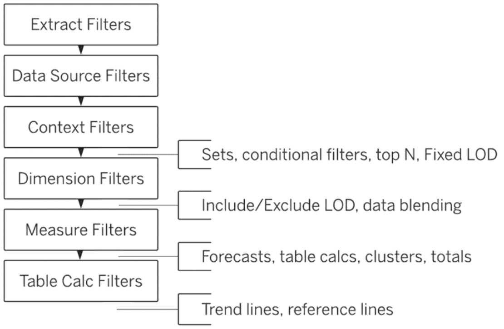

# Tableau Summary
This file is a summary of Tableau features (`what it can do`), NOT an instruction on how to use each of the features. It is intended to give reader an overview of what they can do in Tableau, and therefore know what keywords to search for in Google Search or Tableau Documentation go to learn it. It contains `no redundanct sentences, no BS`. 

This file is mainly intended for Tableau Desktop, because a senior analyst told me this is the most commonly used Tableau version among his projects over the past 10 years. 

This file will be updated daily until complete.

## 🏷 Connect to data
Tableau supports connecting to `hundreds of data sources`, including a number of different `flat file types` as well as a wide range of `server-based data sources`. E.g., to your computer in a spreadsheet or a text file, or in a database on a server. 

Two data connection options: use `live connection (default)`, or use an `extract`. 

A `live connection` is a direct connection to your data, best used when you want to `leverage a high performance database’s capabilities`, or get `real time changes` in viz (when you refresh it...). Sometimes, connecting live can result in a slow experience, depending on the database. You can `manually refresh` the live connection; Tableau will also `refresh the data automatically each time you open` the workbook.

An `extract` is a compressed snapshot of data stored locally. Useful when you `connect to a slow database` or when you want to `take query load off critical systems`. You can also choose to `import only some of the data` to the extract. 

### Metadata
Tableau assigns `metadata` to the data that you bring into it; you can edit the metadata to decide `how the fields to look and function` in a view. It includes the `names of fields`, `data types`, `aggregation information`, and `default display properties`, etc. 

### The Data Source page
In the `data grid` in the `Data Source page`, Tableau shows `some of the metadata` for the dataset, such as `data role` and `field name`. Tableau distinguishes numbers from strings and dates from dates with timestamps etc. Tableau represents these data role assignments with an icon near the field label. For example, Tableau recognizes City as a geographic entity, and therefore assigns it a `Geographic Role` (a common data role), connecting that field to Tableau's generated latitude and longitude coordinates. Note: `This does not change the data type`, which will remain as a string in this case. You can `make edits to the metadata` right `from the data grid`, such as `changing data role` for a field, `rename` a field. 

The `data grid view` and be switched to `metadata grid view`, which shows each field in a row, where you can `rename fields`, or `hide multipe fields at once`. Changes to the metadata in Tableau `don't impact the source data`.

### The Tableau workspace
In `the Tableau workspace`, the `Data pane` on the left lists the fields in the data source, organized into `dimensions`(blue icons) and `measures`(green icons). You can `drag` the fields from the `Data pane` to the `cards` and `shelves` to begin creating viz. You can also `rename fields` from the data pane. 

The `Pages shelf` lets you break a view into a series of pages to navigate your data like a flip-book animation. It can help analyze data changes and discover hidden insights. 

The `Filters shelf` lets you specify which data to include and exclude, to narrow your viz to the most useful information. 

The `Columns and Rows shelves` let you drop fields to create structure of viz.

The `Marks card` let you drop fields to add context and detail to the viz, such as setting mark type, color, size, shape, text, and detail. 

## 🏷 Customize data source
Could do cleanup and organization as you work with the underlying source data, include customizations like `connection information`, `organizational or metadata changes`, `attributes`, or `aliases`. Tableau Desktop allows us to `save these data source customizations for reuse`. It preserves the customizations you make, but it does not change the underlying source data.

Common `changes to data attributes` fall into several categories, all of which are `saved in a Tableau data source (.tds) file`:
- Folder structure
- Measure and dimension conversions
- Field data types (e.g., strings, integers, dates)
- Field properties (e.g., how a field is displayed or aggregated)
- Attributes (e.g., field names)

### Organize fields into folders
Useful when you have `a large number of fields in the Data pane`. For example, you may want to organize all the customer fields, such as Customer Name and Customer ID, into a new folder called "Customer Info."

### Convert fields from measures to dimensions
Tableau automatically predicts and assigns fields to dimensions or measures, but you can `change it from one to the other`. 

### Edit attributes
Tableau allows you to `rename` any of the database fields. 

### Create aliases to rename members in the view
Tableau allows you to create `aliases` for values (labels) inside a field. 

### Edit a field’s default properties (Tableau Desktop only)
You can edit `a field’s default properties`, such as `color`, `number format`, or `aggregation`. This way, every time you add the field to the view, it will maintain its assigned properties.

### Tableau data source (.tds) file
Tableau Desktop can save your customizations (metadata changes) of your data source to a local file in the `Tableau data source (.tds) format`. You can `reuse` the .tds file in different workbooks and `share` the .tds file with other users.

Included in a .tds file:
- Measures converted to dimensions, and Dimensions converted to measures
- Edited field aliases
- Modified default field properties
- Calculated fields
- Groups
- Sets

Not included in a .tds file:
- Login info 
- Vizzes created with the data

### Refresh a viz to reflect new data
Tableau is flexible about `data source updates`. `Adding more columns or rows` to the data source won’t break the viz. 

However, `there are some updates that Tableau can’t accommodate`, like `changes to the structure of the dataset`, such as `rename or remove columns`. Viz will only be impacted by changes to fields that is uses. It can be fixed by replace references for that field. 

### Data extract
A `data extract` is a local subset of a data source: 
- You can create extracts that contain `billions of rows` of data.
- Can be `faster` than working with the original data, because they are usually `smaller` than the original data source. Generally experience `better performance` than the live connections to the original data.
- Allow you to take advantage of `additioanl functionality` that's not available or supported by the original data, such as the ability to compute a distinct count.
- Allow you to save and work with the data `locally` when the original data is not available. Provide `offline access`, `portable`. 
- An extract is a subset of the data, which `limits access to the remainder of the data`. This can aid in data security, administration, and load on workbooks.
- When the original data changes, you need to `manually refresh` the extract. Extracts can be configured to be `full refresh` (default, can take long time for large extracts), replacing all of the data with what’s in the original data source, or `incremental refresh`, adding just the new rows since the previous refresh. An incremental refresh is only possible when you are extracting `all rows` in the database. For `Tableau Desktop`, you can `automate extract refreshes` using the Tableau Data Extract Command Line Utility. For `web authoring`, you can `schedule refresh task`s for `published` extract data sources and published workbooks that connect to extracts. 
- Unfamiliar users `may not realize that some data has been filtered` from the original data source. A good design practice for extracts is to `inform the end user` about what is included and not included in the extract via notes or instructions in the views and dashboards.

**Best practices for incremental extract refreshes:**
- Use full refresh whenever possible. 
- Incremental refreshed extracts should be fully refreshed at regular intervals (e.g. every weekend or monthly) to maximize performance.

Beginning with Tableau version 10.5, when you create a new extract, it uses the `.hyper format`, which takes advantage of the improved data engine which supports faster analytical and query performance for larger data sets. When you perform an extract-related task on a (old) `.tde` format using Tableau version 10.5 or later, the extract is `upgraded to a .hyper` format. After a .tde extract is upgraded to a .hyper extract, it `can't be reverted back`. 

To create an extract, you can do it from the `Data Source page`, or from the `worksheet` so you can choose to only extract the part of data used in the view. Start the extract creation from the worksheet allows you to `configure the extract before Tableau creates it` - can save time for large data sources. You can edit a  extract after you have created it. 

In web authoring (requires Creator role), you can create extracts directly with default extract settings. Extract refreshes for web authors requires Tableau Bridge. 

**Best practices for creating a data extract:**
- `Anggregate` data: so it is much smaller than the transaction level data extract,  which improves query performance.
- `Hide` all unused fields: it can speed extract creation and to preserve storage space.
- `Filter` data:  remove data you do not need.

### Logical tables vs. physical tables in an extract
Two ways to store data in extract: `logical tables` or `physical tables`:
- `Recommended:  Logical tables`, which is the default.
- The `Physical tables` option should be used `sparingly` to help with specific situations such as when the `size of your extract is larger than expected`.

**Logical tables:**

If you use `Logical tables` when your extract contains `joins`, the `joins are applied` when the extract is created.

Use Logical tables when:

- you want to limit the amount of data in your extract with additional extract properties like `extract filters, aggregation, Top N`, or other features that require denormalized data.
- your data uses `pass-through functions (RAWSQL)`.

**Physical tables:**

Physical table uses one extract table for each physical table in the data source. If you use the physical tables, `joins are performed at query time`. Also, you `cannot append data` to it.

Use Physical tables when:
- your extract has `tables created with one or more equality joins` and meets all of these conditions: All joins between physical tables are equality (=) joins; Data types used for relationships or joins are identical; No pass-through functions (RAWSQL) used; No incremental refresh configured; No extract filters configured; No Top N or sampling configured
- the size of your extract is `larger than expected`.

## 🏷 Organize data and create filters
### Group
A group lets you combine several `members` (values) `inside a single dimension (field)` into `a single data point` or `category type`, `aka, combine into one memeber`, by `creating a new dimension` that didn’t originally exist in your data. The new group can be used repeatedly in vizzies. Existing groups can be edited. 

Groups in Tableau are represented by a `paper clip`: . In the `Data pane`, the paper clip to the left of the field indicats a grouped field. In the `tooltip` in the `view`, the paper clip is the `Group Members button` that creates a group.

Groups can be used in diverse ways to answer questions about your data:
- `Ad hoc analysis` - Grouping the destinations that loses the most airline packages that allows the company to discover what they have in common. Group sales of previous exhibits by audience to determine which brought the most visitors in the past. 
- `"What if" scenarios`: Determine what will bring the most profit for future investments by grouping long list of products into categories, to make informed decisions based upon overall profit. 
- `Correcting data errors`: Avoid data duplication (typos): Grouping CA, Calif., and California into one data point. Name changes: A product is renamed, but product itself didn't change - grouping allow to see sales before and after the name change.
- `Reuse`: After the groups are created, they can be used in other ways. 

Groups can be created using:
- `A field in the Data pane`: good for long lists, allows search (exact match, contains, starts with), can drag a member into an existing group in the window, can choose to create a "Other" group to group all the un-grouped members. 
- `Labels or marks in the view`: when you select multiple labels or marks, use the pop up tooltip window to group them. During this process, a group contains selected items is created, also a group called others is created. The newly created group field is instantly used in the view. 

### Hierarchy
A hierarchy is an arrangement of data fields in a hierarchical format with an "above" and "below" structure. A hierarchy preserves the ordering, creates drilling capabilities in the visualization,  and it can be used over and over. Its icon: . 

One of the most useful ways to navigate hierarchies is to drill down using the [+] or drill up using the [-] to hide or display the related fields. The symbol appears on the left of the field when it's on a shelf, on the Marks card, or in the view. 

Date hierarchies: For relational data sources, dates and times are automatically placed in the dimensions area of the Data pane and are identified by the date icon , or date-time icon , and can be drilled up and down as a hierarchy. Date fields can consist of Year, Quarter, Month, Day, Time. Notice that the list order must be preserved for the hierarchy to make sense.

Common examples of subjects with hierarchical categories: Biological classification, Family tree, Geographical locations. 

### Filters
Filtering does not remove or modify data, it just changes the data that appears in your view. 

Filter types
- **Extract filters**
When creating an extract, filter out data unrelevant data. 

- **Data source filters**
Reduce the amount of data being fed into Tableau. Can be used to filter out sensitive data from data source. For systems that rely heavily on partitions or indexing, data source filters may yield tremendous control over the performance of queries issued by Tableau. 

- **Context filters**
All filters in Tableau are computed independently. Context filter is processed first. If you have two dimension filters, one on Region and another top 3 on products, both filters will apply to the entire data set, e.g: product A, D, F are globally top 3, but only A lives through the region filter, so the final result will show only product A. If you want to see the top 3 products in each region, need to set Region as the context filter, in this way, product A, B, C might be the top 3 and all will show up. Context filters are greyed out in the filter pane. 

- **Dimension filters**
Dimensions contain discrete categorical data, so filtering it involves selecting the values to include or exclude. For example, use a dimension filter to show sales in specific regions.

- **Measure filters**
Measures contain quantitative data, so filtering it involves selecting a range of values that you want to include. For example, show only products that have sales greater than 10,000.

- **Date filters**
Date filters allow you to filter data by a range of dates, relative dates, or exact dates. For example, show products that have been ordered starting January 2017. 

- **Table Calculation filters**
Applied after the view has been produced. Suitable if you want to filter the view without filtering the underlying data.

Order of Filters:

Dimension filter: The easiest way is to include or exclude data points (marks) from your view. Another way is to drag the dimension field from the Data pane to the Filters shelf.

Filters can be created on fields that are not in the view. On Tableau Desktop, you can right click fields in data pane and select show filter. Filters can be reused across worksheets (not default). In filter window, 'Use all' is dynamic and adapts to changes, 'Select from' is static and ignores changes. 

You can customize the look and interaction of a filter. The Remove Filter option removes the filter from the Filters shelf. Hide Card/Filter only removes the filter card from the view. 

Tableau can create filters on continuous date values or discrete date parts. For continuous data filter, you can filter by relative dates, range of dates, starting date, ending date, and special (null). 

### Sorting
Computed sort (dynamic) and manual sort. As an author, you can disable the sort icons in published content.

When the values to be sorted occur in multiple panes in a view, there are two ways to sort: nested sort (considers each pane independently and sorts the rows per pane) and non-nested sort (default, considers the value across panes and will have the same order of values per pane).

### Set
Sets are custom binary fields that define a subset of data - for viewing and highlighting data that meet specific criteria. For instance, sets can help you identify customers with sales exceeding a certain threshold. Set can be dynamic (members change with data, can be based on single or multiple dimensions), or fixed (members do not change with data, based on a single dimension only). Sets can be reused throughout the workbook, and it is part of the metadata and saved in .tds file. Sets can be used like any other field in a view (to encode marks, use in calculated fields, use as dimensions (in/out a set), use as filters). 

Use cases for sets:
- View or highlight data that meets a specific computed condition, for example, a set  contains customers with sales exceeding a certain amount.
- Monitor key data points, for example, high- or low-performing sales regions.
- Show members in a field that meets a few conditions, e.g., items that are top sellers but are also highly discounted.
- part-to-whole comparison
- part-to-part comparison (set to set)

You can create a fixed set by selecting marks in a view or using the Create Set option for a dimension from the Data pane. 

In Tableau Desktop, you can combine two sets - you create a new set containing either the combination of all members, just the members that exist in both, or members that exist in one set but not the other. To combine two sets, they must be members of the same field.

To give your audience the ability to quickly modify members of a dynamic set, you can also display a set control. A set control is a worksheet card that is very similar to a parameter control or filter card.

Based on the filter order, Tableau applies set filters before dimension and measure filters. 

## 🏷 Build views
### Visualize time-based data
Tableau provides two ways to visualize date fields: as continuous date values or discrete date parts (default); they are interchangeable in the data pane. Continuous date values, also called date values, represent the chronological progression of time. Date values appear as green fields when placed on a shelf. Discrete date parts are distinct units of time contained in your data. 

Use continuous date values to visualize how your data changes over a range of time. Use discrete date parts when you want to compare a measure for specific units of time

When you add a date field to a view, Tableau automatically selects the highest discrete date part (default) in your data to display. You can change it. 

Note that selecting "Discrete" or "Continuous" from the date field drop-down menu will not change whether a date field is used as a discrete date part or a continuous date value in the view, it will only change how the data is displayed (as headers or axis). You need to select explicitly the lod of the continuous date or discrete date in this dropdown menu. 

If your organization uses a week-based calendar, with Monday as the first day of the week, you can specify the ISO-8601 calendar as your preference for your data source. This change will apply to all worksheets using the data source, affecting date fields, context menus, filters, and so on. 

## 🏷 Map geographic data

## 🏷 Create calculated fields

## 🏷 Apply Table calculations & Seconary table calculations

## 🏷 Create Level of Detail (LOD) expressions

## 🏷 Apply analytics

## 🏷 Connect to multiple data sources
You can also connect to multiple data sources at a time and use relationships, joins, unions, and blends to work with the data. 

## 🏷 Create dashboards

## 🏷 Create stories

## 🏷 Share and publish content

